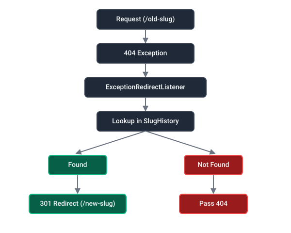

# Slug History Bundle

This document summarizes the bundle's features and shows how to use the APIs.

## Overview

The bundle tracks slug changes on Doctrine entities and automatically redirects old URLs to the current route using `301 Moved Permanently`, preserving SEO when entities' slugs change.

### Main components

- **`DoctrineSlugListener`** — detects slug changes on entities during lifecycle events (`preUpdate`, `postUpdate`, `postPersist`).
- **`SlugManager`** — calculates old→new path mappings and persists them to configured storage.
- **`SlugStorageInterface`** — storage abstraction for slug mappings.
- **`CacheSlugStorage`** — cache-backed implementation (default, no database required).
- **`DatabaseSlugStorage`** — database-backed implementation using Doctrine (requires migration).
- **`ExceptionRedirectListener`** — intercepts 404 errors, resolves old paths, and issues `301` redirects.

---

## Flow diagram

<picture>
  <source srcset="assets/logo-dark-mode.svg" media="(prefers-color-scheme: dark)">
  
</picture>

**Flow:** `DoctrineSlugListener` → `SlugManager` → `SlugStorageInterface` → `ExceptionRedirectListener` (issues `301` redirect).

---

## Installation

Install the bundle with Composer:

```bash
composer require wisymfony/slug-history-bundle
```

The bundle supports automatic registration via Symfony Flex. If your app doesn't auto-register bundles, see [Manual activation](#manual-bundle-activation).

---

## Manual bundle activation

If auto-registration is disabled, enable the bundle in `config/bundles.php`:

```php
Wisymfony\SlugHistoryBundle\SlugHistoryBundle::class => ['all' => true],
```

---

## Quick Start

### 1) Mark a slug field with `#[Slugged]`

```php
use Wisymfony\SlugHistoryBundle\Attribute\Slugged;

class Product
{
    private ?string $slug = null;
    private string $category = 'electronics';

    #[Slugged(
        from: 'title',
        routeName: 'app_product_show',
        routeParams: [
            'category' => '@category',
            'slug' => '@slug',
            'source' => 'legacy'
        ]
    )]
    private ?string $slugField = null;
}
```

**Key notes:**
- Values in `routeParams` starting with `@` (e.g., `@category`) are resolved from entity properties by calling their getter methods (e.g., `getCategory()`).
- Dot-notation is supported for nested objects: `@owner.company.name` resolves to `getOwner()->getCompany()->getName()`.
- `from` specifies a source field used to auto-generate/update the slug when the slug field itself is not changed directly.

---

## `#[Slugged]` attribute options

| Option | Type | Default | Description |
|---|---:|---|---|
| `from` | `string\|null` | `null` | Source field name used to derive the slug value. If the slug property is not updated directly, the value from `from` will be used to regenerate the slug. |
| `routeName` | `string\|null` | `null` | Symfony route name used to generate the old and new path URLs. Route parameters with `@` are resolved from the entity. |
| `routeParams` | `array` | `[]` | Additional route parameters for URL generation. Values starting with `@` are resolved from the entity (e.g., `"category": "@category"`). Supports dot-notation for nested objects. |

---

### 2) Use `SluggedType` in a form

`SluggedType` renders a slug input field with a live preview link. The widget accepts a route configuration and source field mapping.

**Example (form builder):**

```php
use Wisymfony\SlugHistoryBundle\Form\Type\SluggedType;

$builder->add('slug', SluggedType::class, [
    'route' => [
        'name' => 'app_product_show',
        'slugParam' => 'slug',
        'params' => [
            'slug' => '@slug',
            'category' => '@category',
            'source' => 'legacy'
        ]
    ],
    'from' => 'title',
    'showLabel' => 'View the page',
]);
```

**Behavior:**
- Any `route.params` value beginning with `@` is resolved against the form's underlying entity at render time.
- `SluggedType` replaces `@field` tokens with their actual values and builds a `mappingFrom` array to track field dependencies for the client-side preview widget to update dynamically.

---

## `SluggedType` form type options

| Option | Type | Default | Description |
|---|---:|---|---|
| `route` | `array` | `['name' => '', 'slugParam' => '', 'params' => []]` | Route configuration for URL preview. Values starting with `@` map to entity/form properties. |
| `route.name` | `string` | `''` | Symfony route name for the preview URL. |
| `route.slugParam` | `string` | `''` | The route parameter name that holds the slug (e.g., `'slug'`). |
| `route.params` | `array` | `[]` | Default parameters for URL preview. Values beginning with `@` map to entity properties and support dot-notation. |
| `from` | `array` | `[]` | Form field names used to compute preview placeholder values. |
| `showLabel` | `string` | `'Visit →'` | UI label for the preview link button. |

---

## Storage backends

The bundle uses `SlugStorageInterface` to persist slug mappings. Two implementations are provided:

| Backend | Storage | Performance | Use Case |
|---------|---------|-------------|----------|
| `CacheSlugStorage` | Symfony cache pool | Fast (in-memory) | Default; recommended for most apps |
| `DatabaseSlugStorage` | Doctrine ORM | Persistent | Multi-server setups or audit trail requirements |

### Configuration

Choose your backend using **one** of these methods:

#### Method 1: Environment variable (recommended)

Set `WISYMFONY_SLUG_HISTORY_STORAGE` in your `.env` file:

```bash
# .env or .env.local
WISYMFONY_SLUG_HISTORY_STORAGE=cache
```

Then alias `SlugStorageInterface` in `config/services.php`:

```php
use Wisymfony\SlugHistoryBundle\Service\Storage\SlugStorageInterface;
use Wisymfony\SlugHistoryBundle\Service\Storage\CacheSlugStorage;

$services->alias(SlugStorageInterface::class, CacheSlugStorage::class);
```

#### Method 2: Service parameter in `config/services.yaml`

```yaml
parameters:
    wisymfony_slug_history.storage: 'cache'  # or 'database'
```

#### Method 3: Direct service override in `config/services.yaml`

```yaml
services:
    App\Service\MyCustomSlugStorage:
        arguments: ['@my_storage_dependency']

    Wisymfony\SlugHistoryBundle\Service\Manager\SlugManager:
        arguments:
            $storageInterface: '@App\Service\MyCustomSlugStorage'
```

---

## Using DatabaseSlugStorage

To use database-backed storage, the bundle provides a `WiSymfonySlugHistory` entity. Follow these steps:

### Step 1: Verify the entity exists

The entity is included in the bundle at `src/Entity/WiSymfonySlugHistory.php`. It stores:

| Column | Type | Purpose |
|--------|------|---------|
| `id` | UUID or int | Primary key |
| `old_path` | string (2048) | The original URL path |
| `old_path_key` | string (32) | MD5 hash of `old_path` for fast lookup |
| `new_path` | string (2048) | The current URL path |
| `entity_class` | string, nullable | FQCN of the origin entity class |
| `created_at` | datetime | When the mapping was created |
| `last_updated_at` | datetime | When the mapping was last updated |

### Step 2: Create and run the migration

Generate a migration to create the table:

```bash
php bin/console make:migration
php bin/console doctrine:migrations:migrate
```

### Step 3: Switch the storage alias

Update `config/services.php` to use `DatabaseSlugStorage`:

```php
use Wisymfony\SlugHistoryBundle\Service\Storage\SlugStorageInterface;
use Wisymfony\SlugHistoryBundle\Service\Storage\DatabaseSlugStorage;

$services->alias(SlugStorageInterface::class, DatabaseSlugStorage::class);
```

Alternatively, set the environment variable:

```bash
WISYMFONY_SLUG_HISTORY_STORAGE=database
```

---

## How slug lookups and redirects work

When a user requests a URL that no longer exists (HTTP 404):

1. **`ExceptionRedirectListener`** intercepts the `NotFoundHttpException`.
2. Calls **`SlugManager::getNewPath($oldRequestPath)`** to look up the mapping.
3. `SlugManager` queries the configured **`SlugStorageInterface`** using `findPath()`.
4. If a mapping is found, returns the new path. If the new path itself has an old mapping, the lookup follows the chain until the current target is found.
5. **Issues a `301 Moved Permanently`** redirect to the current route.

---

## Route parameter mapping with dot-notation

The bundle resolves `@`-prefixed tokens in `routeParams` by calling getter methods on the entity. Nested properties use dot-notation:

**Example entity:**

```php
class Product
{
    private Company $company;
    private string $slug;

    public function getCompany(): Company { return $this->company; }
    public function getSlug(): string { return $this->slug; }
}

class Company
{
    private string $name;

    public function getName(): string { return $this->name; }
}
```

**Attribute configuration:**

```php
#[Slugged(
    routeParams: [
        'company' => '@company.name',      // resolves getCompany()->getName()
        'slug' => '@slug',                 // resolves getSlug()
    ],
    routeName: 'app_product_show',
)]
private ?string $slugField = null;
```

**Generated URL:** `/products/{company}/{slug}` → `/products/acme/my-product`

---

## Key features

- ✅ Automatic 301 redirects preserve SEO when slugs change
- ✅ Pluggable storage (cache or database)
- ✅ Support for derived slugs (`from` field)
- ✅ Dot-notation for nested entity properties
- ✅ Form widget with live URL preview
- ✅ Multi-server friendly with database backend
- ✅ Compatible with Symfony 6.4, 7.x, and 8.x

---

## Notes & best practices

- **Cache vs. Database:** Use `CacheSlugStorage` for single-server apps (faster, no DB overhead). Use `DatabaseSlugStorage` for distributed systems or when you need a persistent audit trail.
- **Slug preview in forms:** The `SluggedType` widget updates the preview URL in real-time as users edit the form. Ensure `from` field names match your entity properties.
- **Chained redirects:** The bundle automatically resolves chains of old redirects. If slug A → B → C, requesting A will be redirected directly to C.
- **Performance:** `old_path_key` (MD5 hash) is indexed for fast lookups on large datasets.

---

## License

MIT